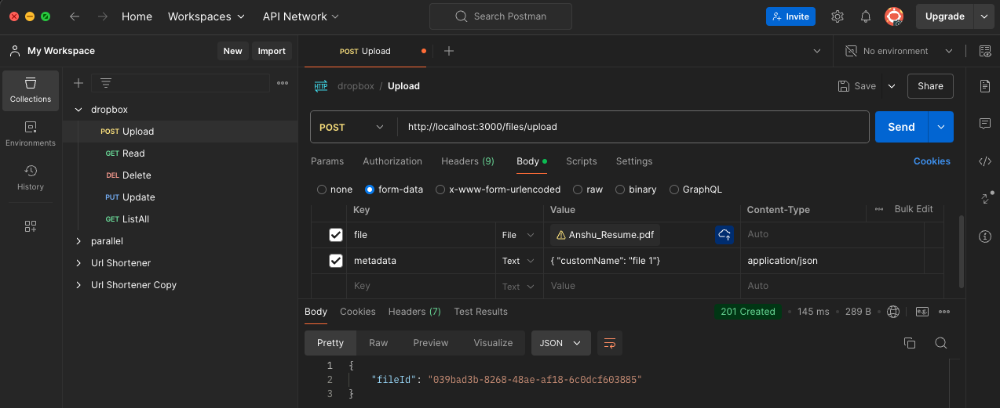
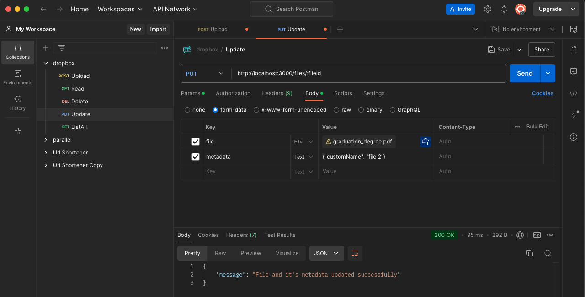
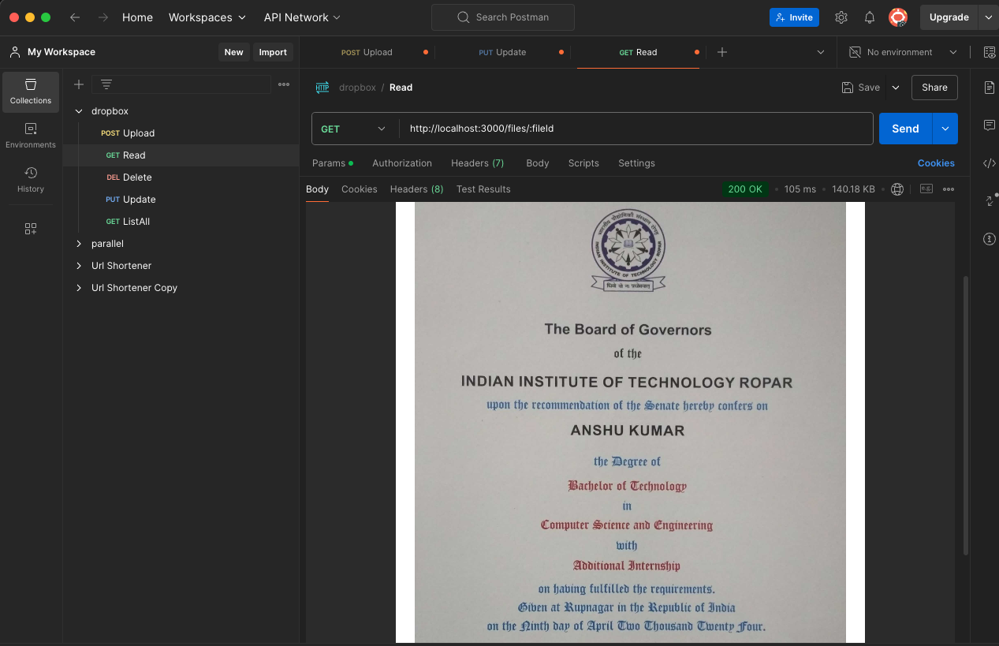
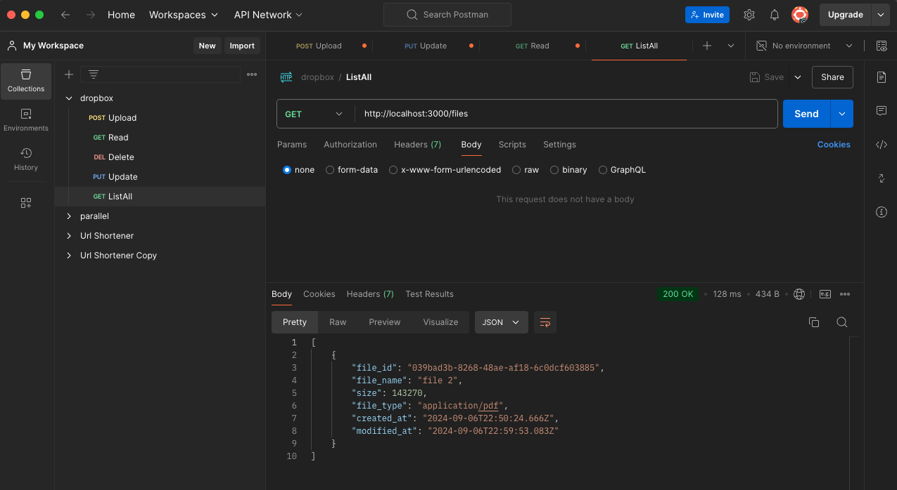
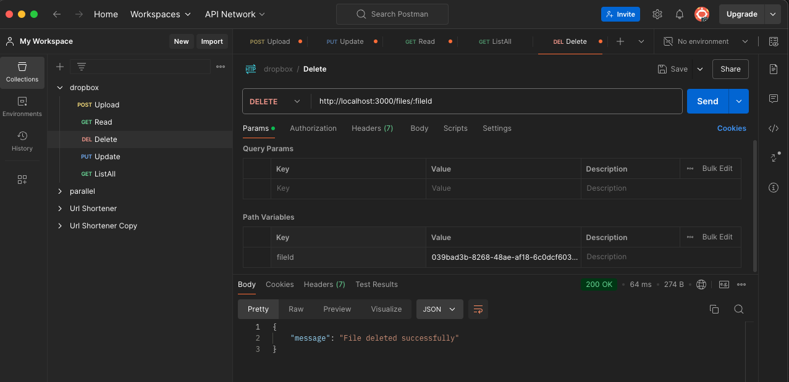

# Dropbox Service

## Description

It a simplified Dropbox like service that allows users to upload, retrieve, update, and delete files via a set of RESTful APIs. 
It also supports storing metadata for each uploaded file, including file name, size, file type, creation and modification timestamp.

## Features

The service provides the following APIs:

1. **Upload File API**
   - **Endpoint**: `POST /files/upload`
   - **Input**: File binary data, custom name
   - **Output**: A unique file identifier
   - **Metadata to Save**: File name, size, file type, createdAt, modifiedAt

2. **Read File API**
   - **Endpoint**: `GET /files/:fileId`
   - **Input**: Unique file identifier
   - **Output**: File binary data

3. **Update File API**
   - **Endpoint**: `PUT /files/:fileId`
   - **Input**: New file binary data or new metadata
   - **Output**: Updated metadata or a success message

4. **Delete File API**
   - **Endpoint**: `DELETE /files/:fileId`
   - **Input**: Unique file identifier
   - **Output**: A success or failure message

5. **List Files API**
   - **Endpoint**: `GET /files`
   - **Input**: None
   - **Output**: A list of file metadata objects, including file IDs, names, size, file type, createdAt and modifiedAt

## Technologies

- **Backend**: Node.js with Express
- **Database**: PostgreSQL
- **File Storage**: Local storage (Extendable to Amazon S3)

## Architecture

1. **Backend Server**: RCSM (Route->Controller->Service->Model) structure
2. **Database**: Stores file's path and it's metadata in Postgresql Database
3. **File Storage**: Uploads folder in src directory of host machine


## API Usage
# Upload and Update Endpoints
To interact with the Upload and Update APIs, use multipart/form-data for the request body. 
The form should include the following keys:
1) File: Use the key `file` to attach the file you want to upload or update.
2) Metadata: Use the key `metadata` to include any associated metadata in JSON format. This field must be sent as `text`.
   The metadata should be structured as follows:

    ```json
    {
        "customName": "file 1"
    }
    ```
Replace "file 1" with the appropriate name for your file.




# Get Endpoints

# Read and List Files

Pass `fileId` as route parameter


No parameter and body needed


# Delete Endpoint

Pass `fileId` as route parameter


## Setup and Running

1. **Clone the repository:**

   ```shell
   git clone https://github.com/anshu-byte/dropbox.git
   ```

2. **Install Docker:**

   Visit https://docs.docker.com/engine/install/ for installation instructions

3. **Required File:**

    Create a .env file in the root directory of the project with the following content

    ```shell
    DB_HOST=localhost
    DB_PORT=5432
    DB_USER=postgres
    DB_PASSWORD=1234
    DB_NAME=dropbox

    CRON_EXPRESSION = */5 * * * *
    PORT=3000
    ```
4. **Go to the project directory:**

    ```shell
    cd dropbox
    ```

5. **Run application:**

    ```shell
    docker compose up
    ```
    This command starts the application using Docker. It sets up all the necessary containers defined in `docker-compose.yml` file


## Node.js Setup (Alternative)
If you prefer to run the application using Node.js instead of Docker, follow these steps:

1. **Install Node.js and npm:**

    Visit https://nodejs.org/ to download and install Node.js, which includes npm.

2. **Install Node Modules:**

    Navigate to the project directory and run:

    ```shell
    npm install
    ```
    This command installs all the required node modules specified in your package.json file.

3. **Start the Application:**

    To start the application, run:

    ```shell
    npm run start
    ```

4. Development Mode:

    For development purposes, you can run:

    ```shell
    npm run watch
    ```
    This will start the application in watch mode, which automatically rebuilds the code and restarts the server on changes.

## Additional Information

1. The maximum file size allowed for uploads is 5 MB.
2. The cron expression is configurable in the .env file under the CRON_EXPRESSION key. Currently, it's running after every 5 minutes
3. Allowed file extensions are `['.jpg', '.jpeg', '.png', '.gif', '.pdf', '.txt', '.docx', '.mp4', '.mkv', '.mov', '.avi', '.mp3', '.xlsx', '.ppt', '.pptx', '.doc', '.odt']`